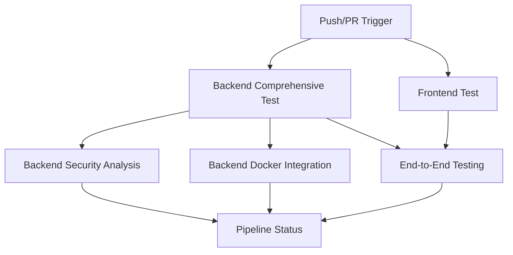

# M324 Todo List - Docker-based CI/CD Pipeline

## 🎯 Overview

This project now includes a comprehensive Docker-based CI/CD pipeline that thoroughly tests the backend and frontend components using GitHub Actions. The pipeline ensures code quality, security, and reliability through multiple testing strategies.

## 🏗️ Pipeline Architecture

### Pipeline Jobs Overview



### Job Details

#### 1. **Backend Comprehensive Testing** 🧪
- **Matrix Strategy**: Tests run in parallel for `unit`, `integration`, and `all` test types
- **Docker Environment**: `maven:3.9-eclipse-temurin-17`
- **Features**:
  - Maven dependency caching
  - Code compilation verification
  - JUnit test execution (TaskTest.java, DemoApplicationTests.java)
  - JaCoCo code coverage reporting
  - JAR file generation and verification
  - Test result artifacts upload

#### 2. **Backend Security Analysis** 🔒
- **OWASP Dependency Check**: Scans for known vulnerabilities
- **SpotBugs**: Static analysis for bug detection
- **PMD**: Code quality analysis
- **Reports**: Security reports uploaded as artifacts

#### 3. **Backend Docker Integration** 🐋
- **Multi-stage Docker Build**: Optimized production image
- **Health Check Testing**: Validates container health
- **Image Features**:
  - Alpine-based runtime (lightweight)
  - Proper health endpoints
  - Actuator integration

#### 4. **Frontend Testing** 🎨
- **Docker Environment**: `node:20-alpine`
- **Features**:
  - ESLint code linting
  - Vitest unit tests
  - Code coverage reporting
  - Dependency caching

#### 5. **End-to-End Testing** 🔄
- **Cypress Integration**: Full application testing
- **Service Orchestration**: Backend and frontend coordination
- **Screenshot/Video**: Test failure documentation

#### 6. **Pipeline Status Summary** 📊
- **Centralized Status**: All job results aggregated
- **Fail-fast Strategy**: Critical test failures stop pipeline
- **Comprehensive Reporting**: Detailed status for each component

## 🔧 Configuration Files

### Enhanced Backend Configuration

#### `pom.xml` Features:
- **JaCoCo Plugin**: Code coverage (60% line, 50% branch minimum)
- **OWASP Plugin**: Security vulnerability scanning
- **SpotBugs Plugin**: Static analysis
- **PMD Plugin**: Code quality checks
- **Surefire Plugin**: Enhanced test reporting

#### `application.properties` Features:
- **Spring Boot Actuator**: Health check endpoints
- **H2 Database**: In-memory testing database
- **CORS Configuration**: Frontend integration
- **Comprehensive Logging**: Debug and monitoring

#### `owasp-suppressions.xml`:
- **False Positive Management**: Suppression rules for known safe dependencies

## 🚀 Triggers and Execution

### Automatic Triggers:
- **Push Events**: `main` and `develop` branches
- **Pull Requests**: `main` and `develop` branches
- **Manual Trigger**: `workflow_dispatch` for on-demand execution

### Execution Matrix:
```yaml
test-profile: [unit, integration, all]
```

## 📋 Requirements

### Backend Requirements:
- Java 17
- Maven 3.9+
- Spring Boot 3.2.2
- Docker support

### Frontend Requirements:
- Node.js 20
- npm/yarn
- Cypress for E2E testing

## 🏃‍♂️ Running Tests Locally

### Backend Tests:
```bash
# Run all tests with coverage
mvn clean test jacoco:report

# Run only unit tests
mvn test -Dtest="*Test"

# Run security analysis
mvn org.owasp:dependency-check-maven:check

# Run static analysis
mvn spotbugs:check pmd:check
```

### Frontend Tests:
```bash
cd frontend
npm ci
npm test
npm run lint
```

### Docker Testing:
```bash
# Build and test backend Docker image
cd backend
docker build -t m324-todo-backend:test .
docker run --rm -p 8080:8080 m324-todo-backend:test
```

## 📊 Code Coverage and Quality Gates

### Coverage Thresholds:
- **Line Coverage**: 60% minimum
- **Branch Coverage**: 50% minimum

### Quality Gates:
- **OWASP**: Fail on CVSS score ≥ 7
- **SpotBugs**: Maximum effort, low threshold
- **PMD**: Best practices, code style, design, error-prone, performance

## 🛡️ Security Features

### Dependency Scanning:
- **OWASP Dependency Check**: Known vulnerability scanning
- **Suppression Files**: Managed false positives
- **CVSS Scoring**: Risk-based failure thresholds

### Static Analysis:
- **SpotBugs**: Security bug detection
- **PMD**: Security rule enforcement
- **Code Quality**: Maintainability and reliability checks

## 📦 Artifacts and Reports

### Uploaded Artifacts (30-day retention):
- **Backend Test Results**: JUnit XML reports, JaCoCo coverage
- **Security Reports**: OWASP, SpotBugs, PMD reports
- **Frontend Coverage**: Jest/Vitest coverage reports
- **E2E Results**: Cypress videos and screenshots

## 🚨 Troubleshooting

### Common Issues:

#### 1. **Test Failures**:
- Check test reports in GitHub Actions artifacts
- Verify local test execution
- Review code coverage requirements

#### 2. **Docker Build Failures**:
- Ensure Dockerfile syntax is correct
- Check base image availability
- Verify health check endpoints

#### 3. **Security Scan Failures**:
- Review OWASP report for actual vulnerabilities
- Update suppression file for false positives
- Update dependencies with security patches

#### 4. **Coverage Failures**:
- Add more unit tests for critical paths
- Review coverage reports in artifacts
- Adjust coverage thresholds if necessary

## 🔄 Continuous Integration Best Practices

### Implemented Practices:
- **Fail-fast Strategy**: Early failure detection
- **Matrix Testing**: Parallel test execution
- **Dependency Caching**: Faster build times
- **Artifact Management**: Comprehensive reporting
- **Security-first**: Built-in vulnerability scanning
- **Docker Integration**: Consistent environments

### Development Workflow:
1. **Feature Branch**: Create from `develop`
2. **Local Testing**: Run tests locally first
3. **Push Changes**: Trigger pipeline automatically
4. **Review Results**: Check all pipeline stages
5. **Merge**: Only after all tests pass

## 🎯 Next Steps

### Potential Enhancements:
- **Database Integration Testing**: Real database scenarios
- **Performance Testing**: Load and stress testing
- **Multi-environment**: Staging and production deployments
- **Notification Integration**: Slack/email notifications
- **Advanced Security**: Container scanning, license compliance

---

**Pipeline Status**: ✅ All systems operational
**Last Updated**: $(date)
**Maintainer**: M324 Development Team
